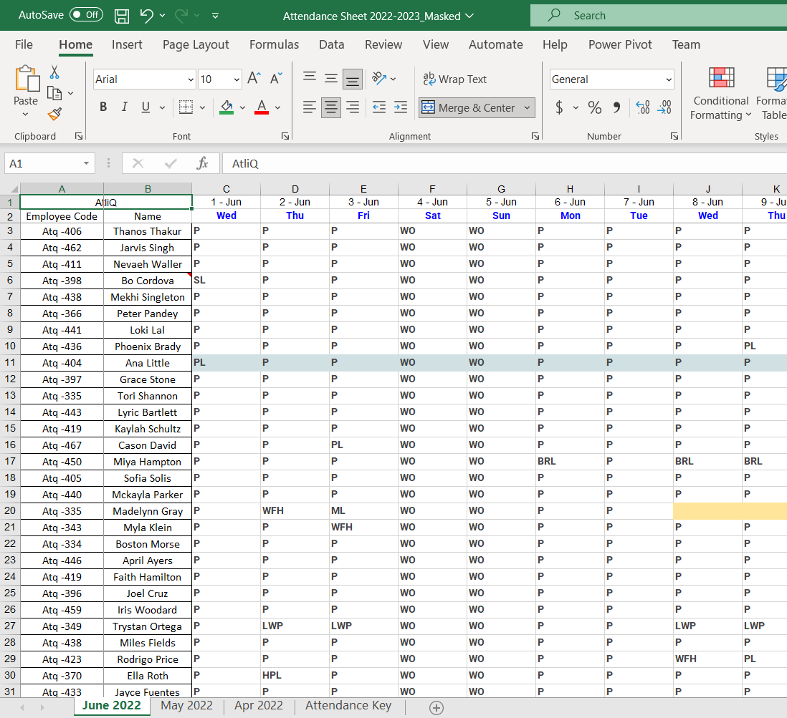
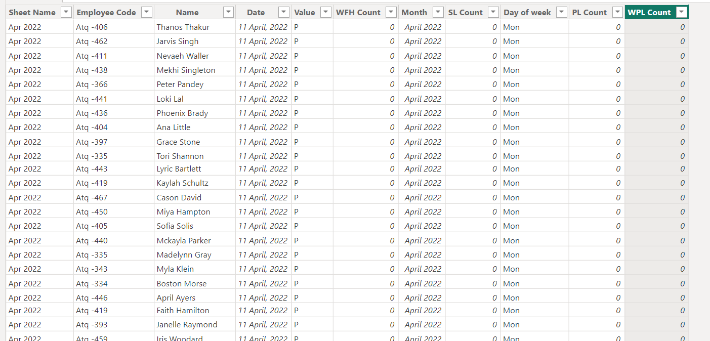
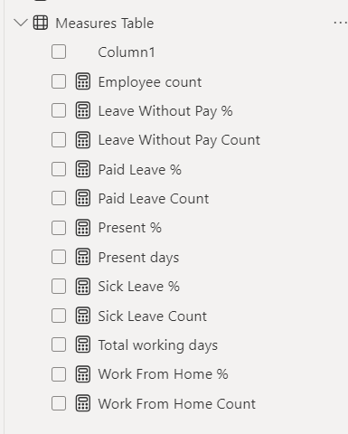
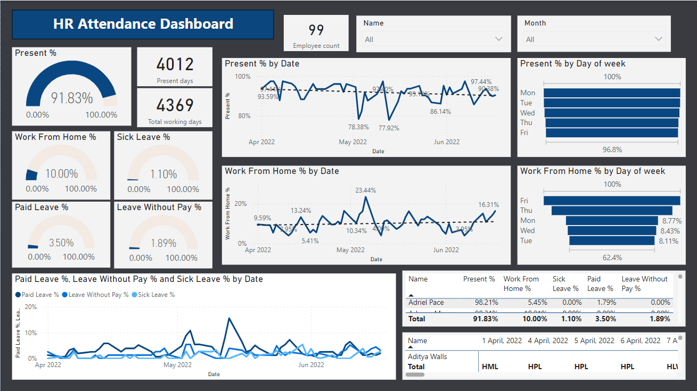
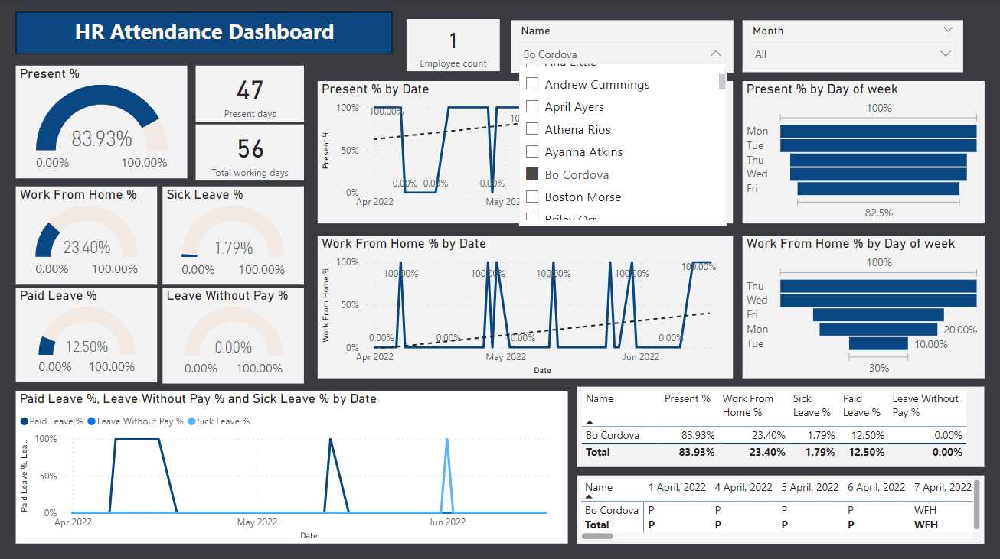
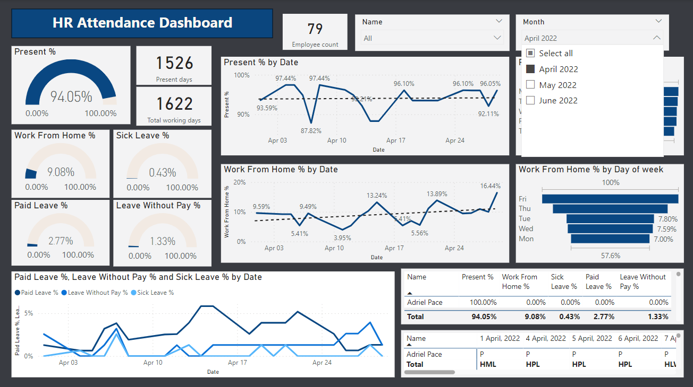

# HR_Dashboard_PowerBI

This projet involved preparing the HR attendance dataset using Power Query, creating specific DAX measures to address key HR metrics, and then presenting these insights through a visually informative Power BI dashboard.

## Data set preparation
Acquired a dataset containing human resources-related information, specifically employee attendance data spanning three months.

## Transforming and loading
Utilized Power Query to transform and load the dataset, ensuring it is in a suitable format for analysis.

## Adressing requirements
Implemented DAX (Data Analysis Expressions) measures to address crucial data requirements:
   - Calculated the percentage of employees present during the given period.
   - Analyzed the percentage of employees working from home.
   - Determined the percentage of employees on sick leave.
   - Computed the percentage of employees on paid leave.
   - Evaluated the percentage of employees on leave without pay.
     

## Dashboard creation
Constructed an interactive and user-friendly dashboard within Power BI for enhanced data visualization and analysis.

## Tools & technologies
- Power BI
- MS Excel
